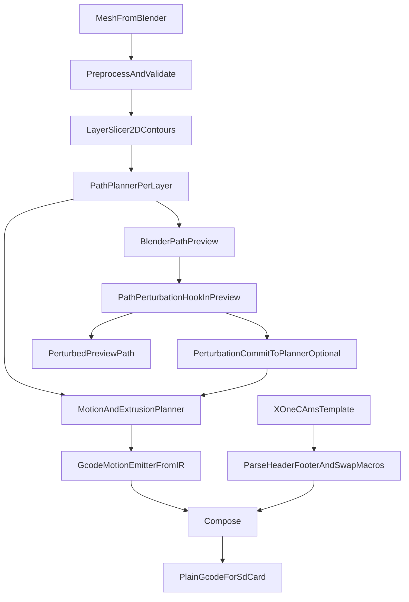

# Blender-to-Bambu Toolpath Architecture

## Scope and Constraints

- Input is a vase-compatible mesh from Blender.
- Output should support both:
  - Print-ready artifacts for Bambu workflow.
  - In-viewport path visualization in Blender.
- Printing is layer-by-layer and constrained to a single perimeter path per layer.
- No shells/infill/support generation in this architecture.
- Future requirement: perturb path geometry based on nearest-point texture/surface features.

## Feasibility Assessment

- Building a full slicer inside Blender is feasible but high-risk/high-effort (robust polygon clipping, path ordering, extrusion planning, machine constraints, travel optimization).
- Producing **deterministic intermediate toolpaths** in Blender is very feasible and aligns with the future perturbation goal.
- Bambu printers (including X1C) accept **plain `.gcode` files via SD card** when the preamble/postamble are correct for the target machine and filament. The `.gcode.3mf` archive is required only for cloud/network printing via Bambu Studio; the firmware "Unzip" hang occurs when an archive-named file fails to extract, not when a plain `.gcode` is loaded.
- Existing slicer CLIs (Bambu Studio, OrcaSlicer) only accept **mesh inputs** ([OrcaSlicer CLI docs](https://deepwiki.com/SoftFever/OrcaSlicer/10.2-cli-mode-and-headless-operation)) and cannot consume our custom toolpaths. But we don't need them to: we use Bambu Studio once per filament to generate a known-good preamble/postamble wrapper for X1C, then splice our IR-derived motion between fixed markers.
- Working precedent: [Boaz's FullControl + A1 mini merger (CodePen)](https://codepen.io/Boaztheostrich/pen/JoKygVL) uses `; OBJECT_ID:` and `; close powerlost recovery` as splice markers and produces a plain `.gcode` that prints from SD card.

## Recommended Architecture (Current + Future-Safe)




### Core design principles

- Keep geometry/path generation independent from printer flavor.
- Introduce a **stable intermediate representation (IR)** between path planning and export.
- Make perturbation a first-class capability of preview, with optional commit back into planning/export when enabled.

### Proposed module boundaries

- `geometry/`:
  - mesh validation (manifold checks, normals, scale)
  - layer intersection and contour extraction
- `pathing/`:
  - single-perimeter generation and ordering
  - seam strategy and travel linking
- `ir/`:
  - canonical data model for layers, segments, attributes
- `modifiers/`:
  - perturbation operators used by preview-time hooks and optional planner commit
- `planner/`:
  - extrusion, feedrates, acceleration intent tags
- `export/`:
  - `PrintIR -> motion G-code bytes` (pure function, single perimeter per layer, emits `; LAYER_CHANGE` + `M73 P*` for printer LCD progress, injects captured swap macros at filament transitions)
  - template manager: loads the single X1C+AMS `.gcode` template, parses out `header`, swap macros `swap_0_to_1` and `swap_1_to_0` (bracketed by `; CP TOOLCHANGE START`/`END`), and `footer`
  - composer: `header + motion_with_inlined_swaps + footer -> final_gcode`
  - optional `PrintIR -> 3MF Slice Extension` writer for debug/interchange (not consumed by Bambu)
- `preview/`:
  - GPU/polyline visualization in Blender
  - `PathPerturbationHook` execution and live controls
  - color by speed/flow/layer/feature

## Intermediate Representation (IR) Requirements

The IR is an **in-memory Python data model**, not a file format. It exists between mesh slicing and G-code emission inside the addon. It does not cross any external tool boundary; the only external handoff is plain G-code bytes to bambox.

Minimum shape:

```python
@dataclass
class Segment:
    p0: Vec3
    p1: Vec3
    e_delta: float
    feedrate: float
    surface_hit: SurfaceSample | None

@dataclass
class Layer:
    z: float
    perimeter: list[Segment]
    filament_index: int

@dataclass
class PrintIR:
    layers: list[Layer]
    machine_profile_id: str
```

- Layer 0 must have `filament_index == 0` (template preamble loads filament 0 first).
- Consecutive layers with different `filament_index` trigger an inlined swap macro at the boundary.

- Layer-level container with ordered paths.
- Exactly one printable path object per layer (single closed loop unless explicitly clipped by model topology rules).
- Segment schema:
  - `xyz_start`, `xyz_end`, `e_delta`, `feedrate`, `feature_type`, `layer_id`
- Surface mapping metadata for future perturbation:
  - nearest triangle ID / barycentric coords or UV lookup cache
  - optional texture sample channels
- Deterministic IDs for diffing and debug (critical for iterative tuning).

## Texture-Perturbation Readiness (Future Goal)

- Build a `SurfaceFieldSampler` now with two modes:
  - UV texture sampling.
  - Geometric field sampling (curvature/noise/procedural).
- Store sampled scalar/vector fields per segment point before export.
- Perturbation plugin contract (executed in preview):
  - input: baseline path + sampled field
  - output: displaced path + optional local width/flow modifiers
- Commit modes:
  - preview-only (non-destructive visual exploration)
  - commit-to-planner/export (writes accepted perturbation into printable path)
- Add guard rails:
  - self-intersection checks
  - min wall thickness / nozzle-width constraints
  - max deviation clamp per layer

## Simpler Alternatives and Trade-offs

1. **Recommended: single X1C+AMS template + IR splice with inlined swap macros -> plain `.gcode` for SD card**
  - One-time setup: in Bambu Studio configure X1C with AMS (filament A in slot 0, filament B in slot 1). Slice a 200x200x200mm placeholder cube with two forced color changes (bands A,B,A) so the export contains both swap macros. Save the `.gcode` as the single addon template.
  - At export: parse template into `header`, `swap_0_to_1` macro, `swap_1_to_0` macro, and `footer`. Emit motion from IR, injecting the appropriate captured swap macro at every layer boundary where `filament_index` changes. Compose `header + motion + footer`.
  - Pros: one template covers both filaments via AMS; no third-party runtime dependency; X1C handles purge via poop chute (no wipe tower needed for our single-perimeter layout). Working precedent: [Boaz CodePen](https://codepen.io/Boaztheostrich/pen/JoKygVL).
  - Cons: template is sticky to the two specific filament materials chosen (changing materials = re-capture). Each AMS swap costs ~30–60s on X1C — many transitions add measurable print time.
2. **Hand-roll `.gcode.3mf` packager**
  - Only needed for cloud/network printing via Bambu Studio (skips SD card).
  - Cons: re-implements bambox; must track Bambu firmware schema (544 keys) over time. Not on the critical path for X1C.
3. **Use bambox**
  - Same archive output as option 2 with less work, but P1S-only validated profile and AGPL on bundled profiles. Not viable for X1C without contributing a profile.
4. **Full custom slicer in Blender**
  - Pros: maximal control and research flexibility.
  - Cons: largest implementation and validation burden; slowest to production reliability.
5. **Hand off to OrcaSlicer/Bambu Studio CLI for slicing**
  - Not viable: their CLIs accept mesh inputs only; our custom paths would be discarded and re-sliced.
6. **Encode paths as 3MF Slice Extension polygons and hand to Bambu**
  - The [3MF Slice Extension](https://github.com/3MFConsortium/spec_slice/blob/master/3MF%20Slice%20Extension.md) `<slicestack>/<slice>/<polygon>` schema maps cleanly onto our per-layer single-perimeter IR.
  - Not viable as a printer handoff: Bambu Studio's 3MF importer only consumes mesh data ([Bambu 3MF compatibility wiki](https://wiki.bambulab.com/en/software/bambu-studio/3mf-compatibility), [BambuStudio#7775](https://github.com/bambulab/BambuStudio/issues/7775)). Printer firmware only executes G-code, never polygons.
  - Useful as a **debug/interchange artifact only**: lib3mf and Microsoft 3D Viewer can read it; third-party verification of slice geometry.

## Validation Strategy

- Goldens for:
  - layer contour extraction
  - exactly one perimeter path per layer
  - path ordering determinism
  - extrusion totals per layer
- Dry-run simulation:
  - collision/self-crossing checks after perturbation
  - travel distance and retraction stats
- Hardware validation ladder:
  - small cylinder test
  - textured perturbation calibration tower
  - full vase-compatible object at target settings

## Recommended phased rollout

1. Implement mesh->layer contours->single-perimeter path with Blender preview.
2. Freeze IR schema (including per-layer `filament_index`) and add deterministic serialization for debug.
3. Implement `PrintIR -> motion G-code` emitter with `; LAYER_CHANGE` + `M73 P*` progress markers and filament-transition detection.
4. Capture one X1C+AMS template via Bambu Studio GUI on a 200x200x200mm cube with two forced color changes (A,B,A bands). Implement template parser that extracts `header`, `swap_0_to_1`, `swap_1_to_0` (via `; CP TOOLCHANGE START/END` brackets), and `footer`. Implement composer that injects swap macros at filament transitions.
5. Hardware-validate on X1C: single-filament cylinder, then bi-color cylinder (one swap), then full vase-compatible object with intended filament plan.
6. Introduce preview-integrated perturbation API and first texture-driven displacement modifier.
7. Add commit-to-planner/export toggle and tune safety constraints with print quality metrics on real hardware.

## Implementation notes

- **Splice markers may differ between Bambu printer models.** Boaz validated `; OBJECT_ID:` / `; close powerlost recovery` on A1 mini. X1C with AMS likely uses the same markers but should be confirmed against an actual X1C export; if different, treat markers as configurable per template.
- **Swap macros must be both directions.** Template needs two forced color changes (A,B,A) so the export contains a 0→1 and a 1→0 swap macro. Each is bracketed by `; CP TOOLCHANGE START` / `; CP TOOLCHANGE END`. Addon extracts both at template-load time.
- **Layer 0 filament constraint.** The preamble loads filament 0 first. IR layer 0 must have `filament_index == 0`; emitter rejects otherwise.
- **Toolchange Z-state defense.** Bambu's swap macro lifts Z, travels to the poop chute, returns. Emit an explicit `G1 Z…` immediately after the swap macro before resuming motion, in case the macro doesn't restore exactly.
- **AMS swap cost.** Each tool change is ~30–60s on X1C. Many swaps add measurable print time; budget for it.
- **Initial nozzle position.** Bambu's preamble ends with the nozzle parked at a known location. Our first motion command must be an absolute `G1` with explicit Z (typically 0.2mm for first layer) and must not assume X/Y.
- **Progress markers.** Emit `; LAYER_CHANGE` and `M73 P<percent> R<minutes>` per layer so the printer LCD progress bar advances; without them, the print works but progress reads 0% throughout.
- **Filament/time totals in template comments are stale** relative to our motion. Cosmetic only (LCD readout); patch if we care.
- **Bounds validation.** At export time, assert that vase footprint fits within the captured template's footprint (200x200). Reject otherwise with a clear error pointing to template re-capture.

## Project delivery: repo vs scene-only

- **A git repo is recommended but not strictly required.** Anything beyond a throwaway script benefits from version control: addon package layout, bundled or user-supplied template paths, tests for splice/parser, and iteration on the IR without losing work.
- **We do not implement the pipeline only “inside the loaded .blend scene.”** The mesh lives in the scene; the logic should live in a **Blender add-on** (or a linked Python package) so we get proper modules, operators, file paths for templates, and reload during development. Storing everything only in Text Editor datablocks is possible for a spike but fights the plan (export, two swap macros, validation, preview).
- **Typical layout:** `blender_addon/` with `__init__.py`, `ir.py`, `slice.py`, `export.py`, `template_parse.py`, `preview.py`, `assets/templates/` (or user-configured path to the user’s captured X1C+AMS `.gcode`). The `.blend` file is optional for dev demos; the add-on is the product surface.

## Architectural verdict

- The architecture is feasible if framed as an IR-first pipeline and not a monolithic “full slicer immediately.”
- The most practical path is hybrid: robust geometry/path authoring in Blender, with cautious printer-flavor adaptation at export.
- This keeps the final texture-perturbation goal first-class without blocking near-term printable results.

