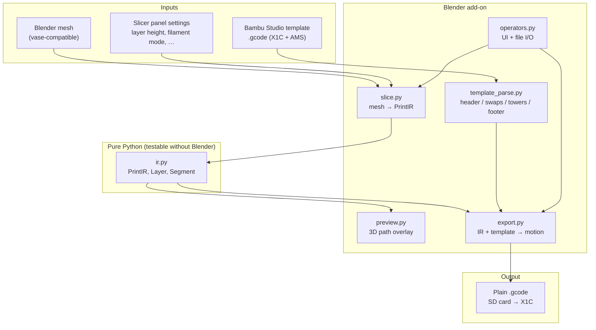
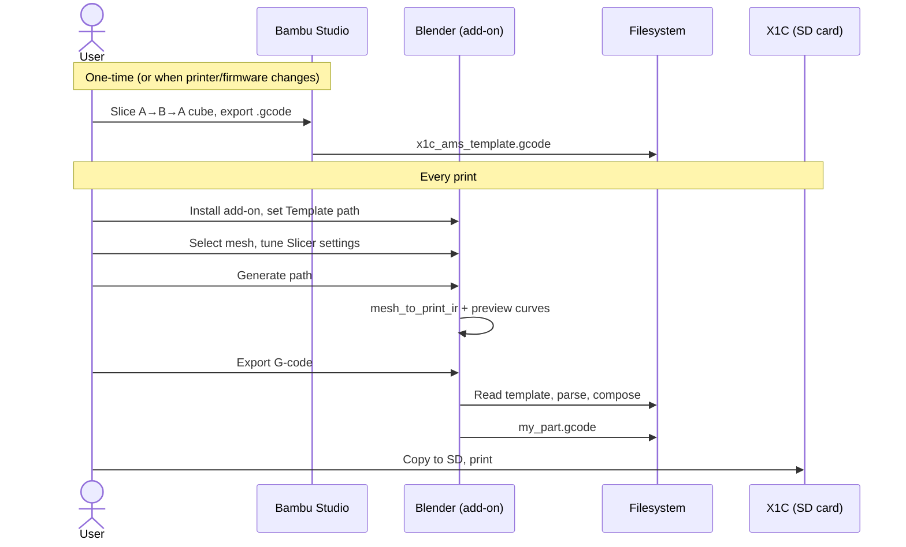
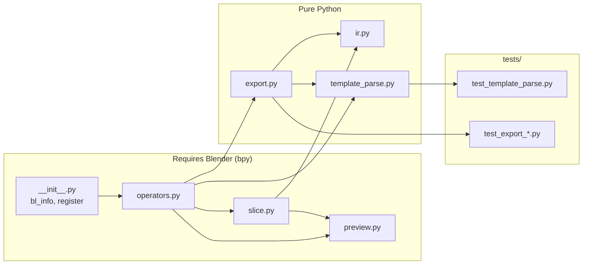
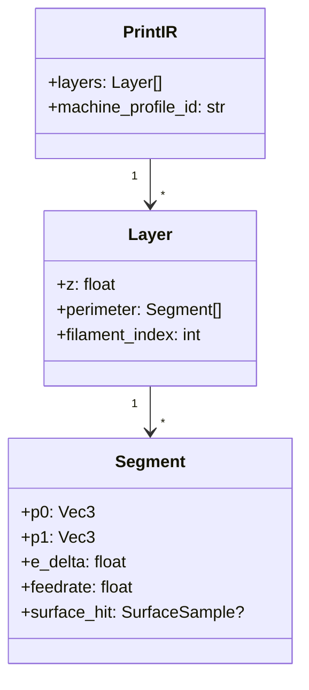
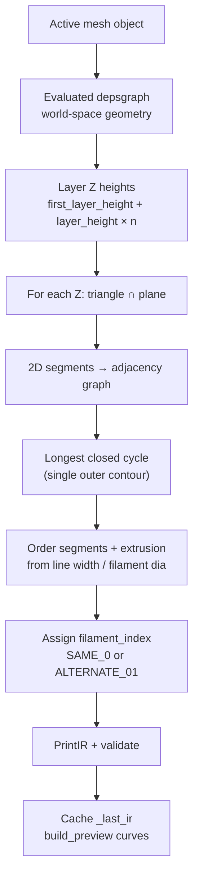
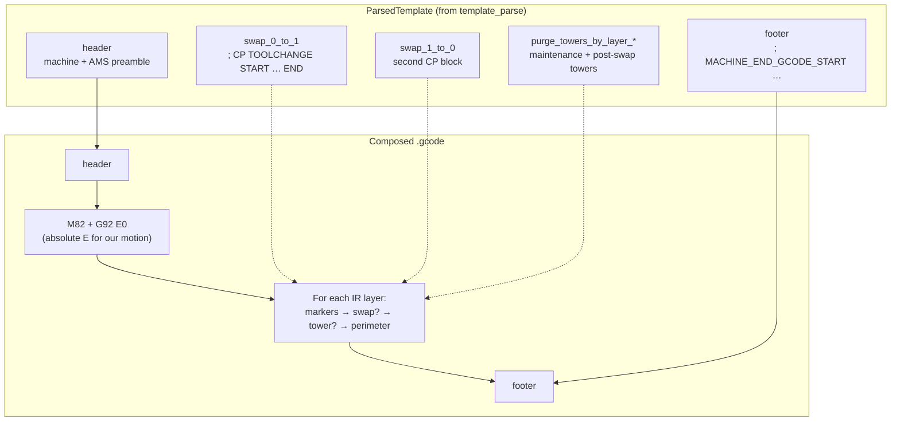
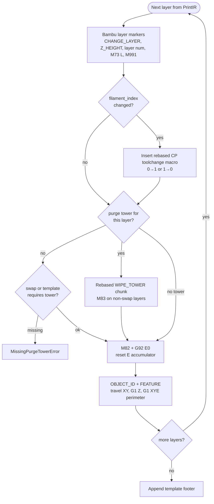
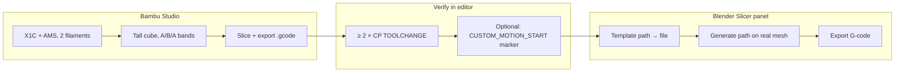
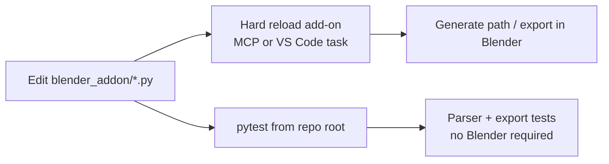

# blender-custom-slicer

Blender add-on that turns a **vase-style mesh** into a **single-perimeter, layer-by-layer toolpath**, then **composes** a Bambu **X1 Carbon + AMS**–compatible `.gcode` file for **SD-card printing**. Custom motion comes from Blender; machine preamble, AMS toolchange macros, purge towers, and shutdown come from a **one-time Bambu Studio template** you capture and reuse.

Operational details, template capture, and dev notes: **[MEMORY.md](MEMORY.md)**.

---

## High-level overview



**Idea in one sentence:** slice geometry in Blender into a stable intermediate representation (IR), then **splice** your per-layer extrusion into a **known-good** Bambu file instead of reimplementing AMS, purge towers, and machine start/end G-code.

---

## End-to-end workflow



---

## Module architecture



| Module | Role |
|--------|------|
| [`blender_addon/ir.py`](blender_addon/ir.py) | Canonical **PrintIR**: layers of perimeter **segments** (XYZ, extrusion, feedrate) + per-layer **filament_index**. |
| [`blender_addon/slice.py`](blender_addon/slice.py) | Mesh ↔ horizontal planes → 2D contours → closed loops → **PrintIR**; stores last IR in memory. |
| [`blender_addon/preview.py`](blender_addon/preview.py) | Builds temporary curve objects in the viewport for visual verification. |
| [`blender_addon/template_parse.py`](blender_addon/template_parse.py) | Splits a Bambu export into **header**, **0→1 / 1→0 swap macros**, **purge tower** chunks (by layer index and/or Z), **footer**. |
| [`blender_addon/export.py`](blender_addon/export.py) | Walks **PrintIR** layers and emits Bambu-style markers, swaps, towers, and **G1** extrusion; prepends header and appends footer. |
| [`blender_addon/operators.py`](blender_addon/operators.py) | **Slicer** sidebar panel, **Generate path**, **Export G-code**, scene properties. |
| [`blender_addon/version.py`](blender_addon/version.py) | `ADDON_VERSION` — bump with `bl_info["version"]` in [`__init__.py`](blender_addon/__init__.py). |

---

## Intermediate representation (PrintIR)



- **Layer 0** must use `filament_index == 0` (matches template loading slot 0).
- One **closed perimeter** per layer (vase mode: no infill, no inner walls).
- Coordinates are in **printer mm** after `scene_bu_to_mm` (Blender units × scene scale × “mm per scene meter”).

---

## Slicing pipeline (mesh → IR)



**Mesh expectations:** vase-compatible outer wall; prefer triangulated or convex faces (n-gons are fan-triangulated from vertex 0 — non-convex polygons can give wrong contours).

---

## G-code composition (template + IR)

A Bambu Studio export is treated as a **macro library** plus machine bookends. The exporter **does not** embed the template’s original object toolpath.



**Header trim (default):** everything before the first `; WIPE_TOWER_START` after `; EXECUTABLE_BLOCK_START` (drops the template cube’s wipe tower and first-color motion). Optional marker `; ---CUSTOM_MOTION_START---` overrides this. See [MEMORY.md](MEMORY.md).

**Footer trim:** only from `; MACHINE_END_GCODE_START` through `; EXECUTABLE_BLOCK_END` — third-filament object motion after the last toolchange is discarded.

---

## Per-layer export order

Order matches native Bambu Studio so **Bambu’s G-code preview** layers Z correctly (especially with AMS).



**XY centering (export only):** optional shift so the IR bounding box is centered on the bed (default 256×256 mm); preview stays aligned with the model.

---

## Template capture (summary)

You need **one** Bambu Studio `.gcode` with **two** `; CP TOOLCHANGE START` … `; CP TOOLCHANGE END` blocks in order **0→1** then **1→0** (e.g. paint a cube **A → B → A**).



Full walkthrough: **[MEMORY.md § Template capture](MEMORY.md#template-capture-one-time)**.

**Dev-only placeholder** (parse/compose tests, **not for printing**): [`blender_addon/assets/minimal_bambu_template_placeholder.gcode`](blender_addon/assets/minimal_bambu_template_placeholder.gcode).

---

## Install and usage

### Install

1. Zip the [`blender_addon`](blender_addon) folder **or** use **Edit → Preferences → Add-ons → Install…** and select that folder.
2. Enable **Custom Slicer (X1C path)**.
3. In the 3D Viewport, press **N** → sidebar tab **Slicer**.

### Typical print workflow

1. **Template path** — your captured X1C+AMS `.gcode` (see above).
2. **Select** a mesh object.
3. Tune **layer height**, **line width**, **mm per scene meter** (default `10` maps scene meters to “centimeter-scale” bed numbers; use `1000` for true metric).
4. **Generate path** — builds IR and viewport preview.
5. **Export G-code** — writes composed file (default **center on bed** at export).

Exports for local iteration: save under [`local_gcode/`](local_gcode/) (gitignored).

### Filament modes

| Mode | Behavior |
|------|----------|
| **Single (slot 0)** | All layers `filament_index = 0`. |
| **Alternate 0/1** | Even layers 0, odd layers 1 — for two-color smoke tests with AMS slots 0 and 1 loaded. |

---

## Development



```bash
pip install pytest
pytest
```

- **Hard reload:** VS Code/Cursor task **“Blender: hard reload add-on (MCP socket)”** → [`scripts/blender_addon_hard_reload_socket.py`](scripts/blender_addon_hard_reload_socket.py).
- **G-code references:** [`docs/gcode-reference/`](docs/gcode-reference/).
- **Architecture notes:** [`PLAN.md`](PLAN.md).

Bump version in both [`blender_addon/version.py`](blender_addon/version.py) and the literal `bl_info["version"]` tuple in [`blender_addon/__init__.py`](blender_addon/__init__.py).

---

## Repository layout

```
blender_addon/          # Installable add-on package
  ir.py                 # PrintIR schema
  slice.py              # Mesh slicing (bpy)
  preview.py            # Viewport curves (bpy)
  template_parse.py     # Bambu template splitter
  export.py             # IR → composed G-code
  operators.py          # UI + operators
  assets/               # Sample templates / reference G-code (tracked)
docs/gcode-reference/   # Vendored Bambu G-code notes
local_gcode/            # Local exports (gitignored)
scripts/                # Dev utilities (hard reload, analysis)
tests/                  # pytest (no Blender)
MEMORY.md               # Assumptions, capture guide, dev invariants
PLAN.md                 # Original architecture / roadmap
```

---

## Limits (MVP)

- **Vase / single-wall** only — no infill, supports, or multiple walls per layer.
- **Plain `.gcode`** for SD card — no `.gcode.3mf` cloud packaging.
- **Two-filament AMS** template with both swap directions captured; N-filament generalization not implemented.
- **Hardware validation** is manual on the printer ([checklist in MEMORY.md](MEMORY.md#manual-hardware-checklist)).

---

## License

See repository defaults; no separate license file called out in-tree.
